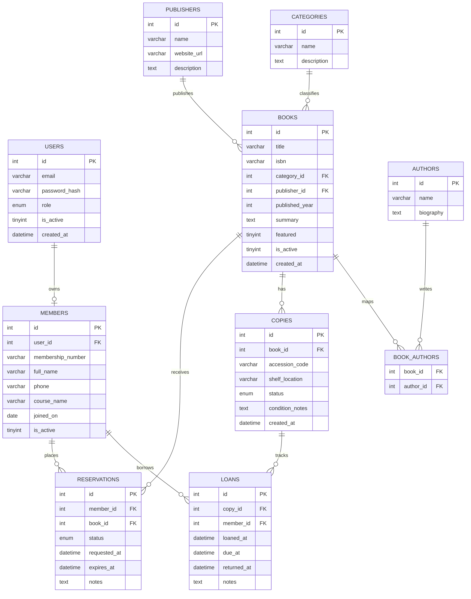

# Campus Library Portal — Entity Relationship Diagram

```mermaid
erDiagram
    USERS ||--o| MEMBERS : "owns"
    MEMBERS ||--o{ LOANS : "borrows"
    MEMBERS ||--o{ RESERVATIONS : "places"
    CATEGORIES ||--o{ BOOKS : "classifies"
    PUBLISHERS ||--o{ BOOKS : "publishes"
    BOOKS ||--o{ BOOK_AUTHORS : "maps"
    AUTHORS ||--o{ BOOK_AUTHORS : "writes"
    BOOKS ||--o{ COPIES : "has"
    COPIES ||--o{ LOANS : "tracks"
    BOOKS ||--o{ RESERVATIONS : "receives"

    USERS {
        int id PK
        varchar email
        varchar password_hash
        enum role
        tinyint is_active
        datetime created_at
    }

    MEMBERS {
        int id PK
        int user_id FK
        varchar membership_number
        varchar full_name
        varchar phone
        varchar course_name
        date joined_on
        tinyint is_active
    }

    CATEGORIES {
        int id PK
        varchar name
        text description
    }

    PUBLISHERS {
        int id PK
        varchar name
        varchar website_url
        text description
    }

    AUTHORS {
        int id PK
        varchar name
        text biography
    }

    BOOKS {
        int id PK
        varchar title
        varchar isbn
        int category_id FK
        int publisher_id FK
        int published_year
        text summary
        tinyint featured
        tinyint is_active
        datetime created_at
    }

    BOOK_AUTHORS {
        int book_id FK
        int author_id FK
    }

    COPIES {
        int id PK
        int book_id FK
        varchar accession_code
        varchar shelf_location
        enum status
        text condition_notes
        datetime created_at
    }

    LOANS {
        int id PK
        int copy_id FK
        int member_id FK
        datetime loaned_at
        datetime due_at
        datetime returned_at
        text notes
    }

    RESERVATIONS {
        int id PK
        int member_id FK
        int book_id FK
        enum status
        datetime requested_at
        datetime expires_at
        text notes
    }
```
